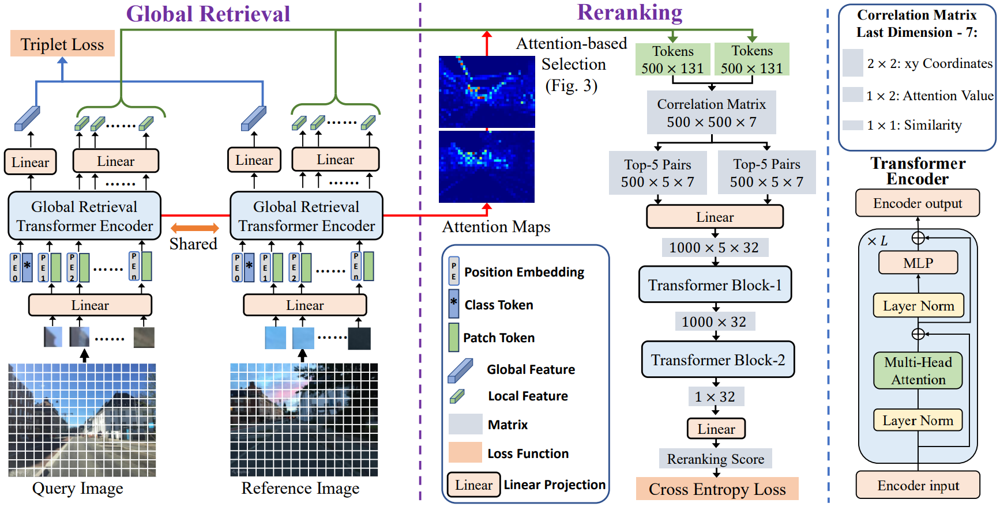

# $R^{2}$ Former: Unified $R$ etrieval and $R$ eranking Transformer for Place Recognition

Please find the official repository at: [https://github.com/bytedance/R2Former](https://github.com/bytedance/R2Former) for the CVPR 2023 (Hightlight) paper: [$R^{2}$ Former: Unified $R$ etrieval and $R$ eranking Transformer for Place Recognition](https://openaccess.thecvf.com/content/CVPR2023/html/Zhu_R2Former_Unified_Retrieval_and_Reranking_Transformer_for_Place_Recognition_CVPR_2023_paper.html).

 

```
@inproceedings{zhu2023r2former,
  title={R2former: Unified retrieval and reranking transformer for place recognition},
  author={Zhu, Sijie and Yang, Linjie and Chen, Chen and Shah, Mubarak and Shen, Xiaohui and Wang, Heng},
  booktitle={Proceedings of the IEEE/CVF Conference on Computer Vision and Pattern Recognition},
  pages={19370--19380},
  year={2023}
}
```